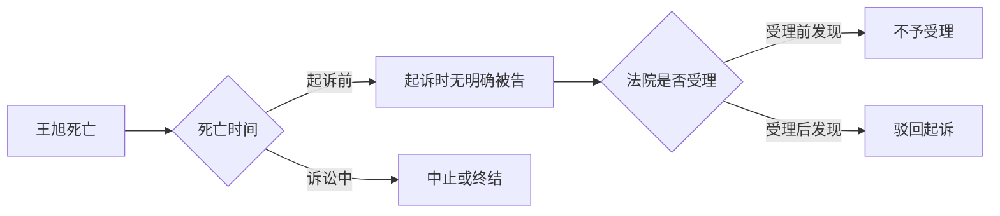

# GoldQuest 第 145 题排版强度校准

以下三个版本均保留原解析信息，只用于校准视觉强度。它们不是可复制模板；实际输出应从原解析的时间、主体、条件、对比、因果和例外关系选择结构。

---

## A. 克制型：主要依靠层级与颜色

###### 答案与解析

- 正确答案：B。
{: custom-qb-section="solution"}

*解题结论*：本题选择 ==B==。

- **判断起点**{: style="color: var(--b3-font-color10);"}：题目明确交代，**王旭**{: style="color: var(--b3-font-color4);"}在**张丽**{: style="color: var(--b3-font-color4);"}起诉前已经死亡。
    - 起诉时，被告已无**主体资格**{: style="color: var(--b3-font-color13);"}。
    - 因而本案不满足`有明确的被告`这一起诉条件。

- **程序定位**{: style="color: var(--b3-font-color10);"}：法院已经受理案件，之后才发现起诉条件欠缺。
    - **受理前**发现 → 裁定不予受理。
    - **受理后**发现 → 裁定**驳回起诉**{: style="color: var(--b3-font-color8);"}。
    - 实体审理后请求不能成立 → 判决驳回诉讼请求。

> [!CAUTION] ⚠️ 不要被“离婚 + 死亡”带偏
> 本题中的死亡发生在**起诉前**，不是诉讼进行中。只有诉讼中一方当事人死亡，才进入诉讼中止或终结的判断；本题首先卡在**起诉条件**。

---

## B. 均衡型：结论、推理链、陷阱和局部对比并用（推荐）

###### 答案与解析

- 正确答案：B。
{: custom-qb-section="solution"}

> [!IMPORTANT] ❗ 一句话定案
> **王旭**{: style="color: var(--b3-font-color4);"}在起诉前死亡 → 起诉时没有明确被告 → 法院在**受理后**{: style="color: var(--b3-font-color12);"}才发现 → 裁定==驳回起诉==。

###### 判断链

1. **死亡时间**{: style="color: var(--b3-font-color10);"}
    - **起诉前**{: style="color: var(--b3-font-color12);"}已经死亡，说明被告在起诉时已经没有诉讼权利能力。
    - 所以本案欠缺“有明确被告”的起诉条件。
2. **程序阶段**{: style="color: var(--b3-font-color10);"}
    - 题干写明法院已经向王旭送达应诉通知书，说明案件已经受理。
    - 受理后发现不符合起诉条件，应当裁定**驳回起诉**{: style="color: var(--b3-font-color8);"}。
3. **排除项**{: style="color: var(--b3-font-color10);"}
    - A 项“诉讼终结”针对诉讼中出现的死亡。
    - C 项“不予受理”针对法院受理前发现起诉条件欠缺。
    - D 项“驳回诉讼请求”针对实体审理后请求不能获得支持。

###### 三种驳回的定位

| 处理方式 | 发现阶段 | 判断性质 |
| :--- | :--- | :--- |
| 不予受理 | **受理前**{: style="color: var(--b3-font-color12);"} | 程序条件欠缺 |
| 驳回起诉 | **受理后**{: style="color: var(--b3-font-color8);"} | 程序条件欠缺 |
| 驳回诉讼请求 | 实体审理后 | 实体请求不成立 |

> [!CAUTION] ⚠️ 最大陷阱
> 看到“离婚”和“死亡”就套用诉讼终结，会跳过最先需要判断的时间节点。本题的检索顺序应当是：**死亡发生在何时** → **起诉条件是否存在** → **法院是否已经受理**。

###### 当事人死亡的后续分流

- **起诉前**{: style="color: var(--b3-font-color13);"}被告死亡
    - 受理前发现：裁定不予受理。
    - 受理后发现：裁定驳回起诉。
- **诉讼中**{: style="color: var(--b3-font-color10);"}一方死亡
    - 一般案件：先中止，等待继承人表态；无人继承或继承人放弃权利时终结。
    - 离婚、解除收养关系、追索赡养费/扶养费/抚养费案件：身份关系不能继承，直接终结。

*复习抓手*：先找**时间点**{: style="text-decoration: underline;"}，再找**程序阶段**，最后判断==裁判形式==。

---

## C. 丰富型：流程图承担主线，文字负责解释边界

###### 答案与解析

- 正确答案：B。
{: custom-qb-section="solution"}

*解题结论*：法院应当裁定 ==驳回起诉==。

###### 一眼定位

> [!IMPORTANT] ❗ 本题落点
> 题干已经出现送达应诉通知书这一信息，说明案件处于**受理后**。因此路径落在：起诉前死亡 → 无明确被告 → 受理后发现 → **驳回起诉**{: style="color: var(--b3-font-color8);"}。

###### 为什么其他选项不成立

- ~~A. 诉讼终结~~
    - 诉讼终结要求死亡发生在诉讼过程中；本题在起诉前已经死亡。
- **B. 驳回起诉**{: style="color: var(--b3-font-color8);"}
    - 法院受理后发现欠缺起诉条件，处理正确。
- ~~C. 不予受理~~
    - 适用于受理前已经发现欠缺起诉条件。
- ~~D. 驳回诉讼请求~~
    - 这是实体审理后的败诉判决；本题尚未进入实体判断。

> [!CAUTION] ⚠️ 题目设置的视觉干扰
> “离婚”“死亡”都是醒目的词，但真正控制答案的是两个不显眼的时间信息：**起诉前**和**已经受理**。复习时应优先给决定程序分流的时间词着色，而不是只给案件类型加粗。

###### 关联规则

| 问题 | 判断 | 后果 |
| :--- | :--- | :--- |
| 起诉时有无明确被告 | 无 | 起诉条件欠缺 |
| 法院是否已经受理 | 是 | 驳回起诉 |
| 是否经过实体审理 | 否 | 不适用驳回诉讼请求 |

*记忆句*：**先死亡，后起诉；已受理，驳起诉。**
