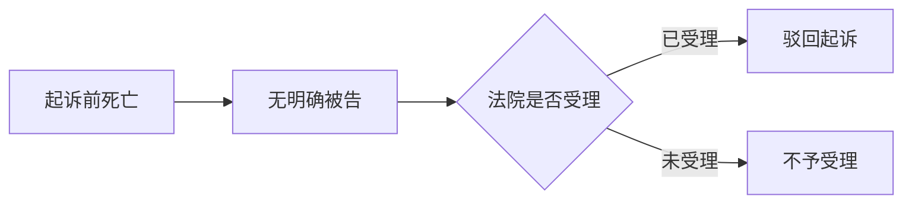
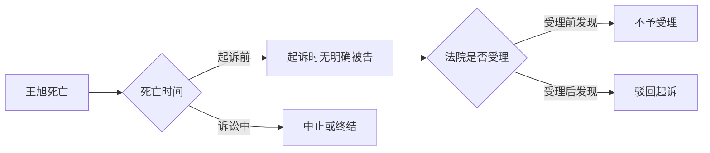

# GoldQuest 第 145 题排版强度校准

以下版本只校准阅读密度，不是固定模板。
本题属于中等复杂度：A 仅作低强度反例，B、C 才是可交付的丰富型变体。

---

## A. 低强度反例：本题不应按此交付

###### 答案与解析

- 正确答案：B。
{: custom-qb-section="solution"}

<em>解题结论</em>：本题选择 ==B==。

- **判断起点**{: style="color: var(--b3-font-color10);"}：题目明确交代：
    - **王旭**{: style="color: var(--b3-font-color4);"}在**张丽**{: style="color: var(--b3-font-color3);"}起诉前已经死亡。
    - 起诉时，**被告**{: style="color: var(--b3-font-color4);"}已无**主体资格**{: style="color: var(--b3-font-color13);"}。
    - 因而本案不满足`有明确的被告`这一起诉条件。

- **程序定位**{: style="color: var(--b3-font-color10);"}：**法院**{: style="color: var(--b3-font-color11);"}已经受理案件。
    - 之后才发现**起诉条件**{: style="color: var(--b3-font-color13);"}欠缺。
    - **受理前**发现 → 裁定不予受理。
    - **受理后**发现 → 裁定**驳回起诉**{: style="color: var(--b3-font-color8);"}。
    - 实体审理后请求不能成立 → 判决驳回诉讼请求。

> [!CAUTION] ⚠️ 不要被“离婚 + 死亡”带偏
> - 本题死亡发生在**起诉前**{: style="color: var(--b3-font-color12);"}，不是诉讼进行中。
> - 只有**诉讼中**{: style="color: var(--b3-font-color10);"}一方死亡，才判断中止或终结。
> - 本题首先卡在==起诉条件==。

---

## B. 丰富型：关系图、推理链、陷阱和局部对比并用

###### 答案与解析

- 正确答案：B。
{: custom-qb-section="solution"}

> [!IMPORTANT] ❗ 一句话定案
> - **王旭**{: style="color: var(--b3-font-color4);"}在**起诉前**{: style="color: var(--b3-font-color12); background-color: var(--b3-font-background12);"}死亡。
> - **法院**{: style="color: var(--b3-font-color11);"}在**受理后**{: style="background-color: var(--b3-font-background12);"}才发现条件欠缺。
> - 最终裁定**驳回起诉**{: style="color: var(--b3-font-color8); background-color: var(--b3-font-background8);"}。

###### 主线图

###### 判断链

1. **死亡时间**{: style="color: var(--b3-font-color10);"}
    - **起诉前**{: style="color: var(--b3-font-color12);"}已经死亡。
    - **被告**{: style="color: var(--b3-font-color4);"}在起诉时已无**诉讼权利能力**{: style="color: var(--b3-font-color13); background-color: var(--b3-font-background13);"}。
    - 所以本案不满足`有明确的被告`这一起诉条件。
2. **程序阶段**{: style="color: var(--b3-font-color10);"}
    - **法院**{: style="color: var(--b3-font-color11);"}已向**王旭**{: style="color: var(--b3-font-color4);"}送达应诉通知书。
    - 这说明案件已经==受理==。
    - 受理后发现不符合起诉条件，应当裁定**驳回起诉**{: style="color: var(--b3-font-color8);"}。
3. **排除项**{: style="color: var(--b3-font-color10);"}
    - ❌ ~~A 项：诉讼终结~~
        - 针对**诉讼中**{: style="color: var(--b3-font-color10);"}出现的死亡。
    - ❌ ~~C 项：不予受理~~
        - 针对**法院**{: style="color: var(--b3-font-color11);"}在受理前发现条件欠缺。
    - ❌ ~~D 项：驳回诉讼请求~~
        - 针对**实体审理后**{: style="color: var(--b3-font-color13);"}请求不能获得支持。
    - ✅ **B 项：驳回起诉**{: style="color: var(--b3-font-color8); background-color: var(--b3-font-background8);"}

> [!NOTE] 📖 固定判断用语
> `有明确的被告`属于**起诉条件**{: style="color: var(--b3-font-color13);"}。
> 本题应先检查该条件是否存在，再判断裁判形式。

###### 三种驳回的定位

| 处理方式 | 发现阶段 | 判断性质 |
| :--- | :--- | :--- |
| 不予受理 | **受理前**{: style="background-color: var(--b3-font-background12);"} | 程序条件欠缺 |
| 驳回起诉 | **受理后**{: style="color: var(--b3-font-color8); background-color: var(--b3-font-background8);"} | 程序条件欠缺 |
| 驳回诉讼请求 | 实体审理后 | 实体请求不成立 |

> [!CAUTION] ⚠️ 最大陷阱
> - 看到“离婚”和“死亡”就套用诉讼终结，
>     - 会跳过最先判断的**时间节点**{: style="color: var(--b3-font-color12);"}。
> - 本题的检索顺序是：
>     - **死亡时间**{: style="color: var(--b3-font-color10);"}
>     - **起诉条件**{: style="color: var(--b3-font-color13);"}
>     - **受理阶段**{: style="color: var(--b3-font-color11);"}

> <em>先查条件是否存在，再决定裁判形式。</em>

---

###### 当事人死亡的后续分流

- **起诉前**{: style="color: var(--b3-font-color13);"}，**被告**{: style="color: var(--b3-font-color4);"}死亡
    - 受理前发现：裁定不予受理。
    - 受理后发现：裁定驳回起诉。
- **诉讼中**{: style="color: var(--b3-font-color10);"}一方死亡
    - **一般案件**{: style="color: var(--b3-font-color10);"}：先中止，等待继承人表态。
        - 无人继承或继承人放弃权利时，==终结==。
    - **身份案件**{: style="color: var(--b3-font-color11);"}：身份关系不能继承。
        - 离婚、解除收养关系等案件直接==终结==。

> [!TIP] 🧭 复习抓手
> <em>检索顺序</em>：先找**时间点**{: style="text-decoration: underline;"}，再找**程序阶段**，最后判断==裁判形式==。

---

## C. 丰富型：流程图承担主线，文字负责解释边界

###### 答案与解析

- 正确答案：B。
{: custom-qb-section="solution"}

<em>解题结论</em>：**法院**{: style="color: var(--b3-font-color11);"}应当裁定 **驳回起诉**{: style="color: var(--b3-font-color8); background-color: var(--b3-font-background8);"}。

###### 一眼定位

> [!IMPORTANT] ❗ 本题落点
> - 送达应诉通知书说明案件处于**受理后**{: style="color: var(--b3-font-color12); background-color: var(--b3-font-background12);"}。
> - 路径依次经过：
>     - **起诉前**{: style="background-color: var(--b3-font-background12);"}死亡
>     - 欠缺`有明确的被告`
>     - **受理后**{: style="color: var(--b3-font-color12);"}发现
>     - 裁定**驳回起诉**{: style="color: var(--b3-font-color8); background-color: var(--b3-font-background8);"}

###### 为什么其他选项不成立

- ❌ ~~A. 诉讼终结~~
    - 要求死亡发生在**诉讼中**{: style="color: var(--b3-font-color10);"}。
    - 本题发生在**起诉前**{: style="color: var(--b3-font-color12);"}。
- ✅ **B. 驳回起诉**{: style="color: var(--b3-font-color8); background-color: var(--b3-font-background8);"}
    - **法院**{: style="color: var(--b3-font-color11);"}在**受理后**{: style="color: var(--b3-font-color12);"}发现条件欠缺。
    - 因而处理==正确==。
- ❌ ~~C. 不予受理~~
    - 适用于受理前已经发现欠缺起诉条件。
- ❌ ~~D. 驳回诉讼请求~~
    - 这是实体审理后的败诉判决；本题尚未进入实体判断。

> [!CAUTION] ⚠️ 题目设置的视觉干扰
> - “离婚”“死亡”只是**视觉干扰**{: style="color: var(--b3-font-color5);"}。
> - 真正控制答案的是：
>     - **起诉前**{: style="color: var(--b3-font-color12);"}
>     - **已经受理**{: style="color: var(--b3-font-color11);"}
> - 应优先标记决定程序分流的==时间词==。

---

###### 关联规则

| 问题 | 判断 | 后果 |
| :--- | :--- | :--- |
| 起诉时有无明确被告 | 无 | 起诉条件欠缺 |
| 法院是否已经受理 | 是 | 驳回起诉 |
| 是否经过实体审理 | 否 | 不适用驳回诉讼请求 |

> [!TIP] 🧭 比较轴
> - 先看**死亡时间**{: style="text-decoration: underline;"}。
> - 再看**受理阶段**{: style="color: var(--b3-font-color11);"}。
> - 最后判断==裁判形式==。

<em>记忆句</em>：**先死亡，后起诉；已受理，驳起诉。**
