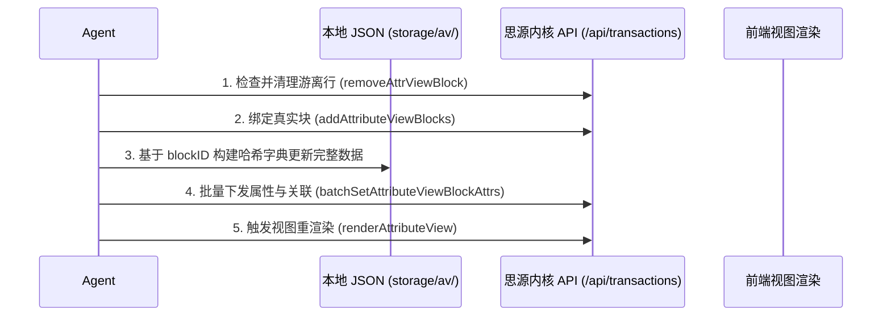

# SiYuan Database (Attribute View / 数据库) Management Skill

This skill documents critical architectural principles, schema definitions, API endpoints, transaction actions, Go template syntax rules, and error-prevention guidelines learned from managing complex SiYuan Attribute Views.

---

## 1. 核心避坑指南：四大致命问题与防御规程

### 问题 1 & 2：避免绑定到游离行 & 避免游离行与绑定行重复

#### 根本原因 (Root Cause)
在向数据库添加块（`/api/av/addAttributeViewBlocks`）或使用纯文本初建表格时：
1. 若之前已经存在未绑定的占位行（`blockID` 存在但 `block.id` 为空，或 `isDetached: true`），调用添加块接口不会自动覆盖它们，而是**追加新行**，导致表格行数翻倍（例如 217 行变成 504 行，前半部分为游离占位行，后半部分为真实绑定行）。
2. 在更新单元格时，如果按数组索引顺序 `idx` 更新，可能将数据写入前半部分的游离行，而真实绑定的行依然为空。

#### 标准防御与修复流程 (Standard Runbook)
1. **绑定前状态检查**：在添加真实块之前，先获取当前所有行的 `blockID` 与 `block.id`，找出所有游离行（`not v.get('block', {}).get('id')` 或 `isDetached: true`）。
2. **内核事务清理游离行 (Purge Detached Rows)**：
   必须通过 `/api/transactions` 调用 `removeAttrViewBlock` 事务彻底从内核与内存中注销游离行：
   ```python
   sy_req('/api/transactions', {
       'app': 'siyuan-agent',
       'session': 'siyuan-agent',
       'reqId': int(time.time() * 1000),
       'transactions': [{
           'doOperations': [{
               'action': 'removeAttrViewBlock',
               'srcIDs': detached_block_ids,
               'avID': av_id
           }]
       }]
   })
   ```
3. **真实块原子添加**：清理完成后，再调用 `/api/av/addAttributeViewBlocks` 添加真实文档块，确保数据库中**每一个行项的 `blockID` 严格对应真实文档的 `id`**。

---

### 问题 3：保护多选列 (mSelect) 与单选列 (select) 的选项池与顺序

#### 根本原因 (Root Cause)
在更新 `select` / `mSelect` 列的单元格内容时：
1. 如果直接传入未在 `key.options` 注册的选项对象，或直接覆写 `keyValues`，会导致原有的颜色调色板丢失，或者选项在过滤/看板视图中被重置。
2. 多选列的单元格值是对象列表 `mSelect: [{"content": "...", "color": "..."}]`，直接按顺序 `values[idx]` 赋值会导致不同行标签错位。

#### 标准保护方案 (Option Pool & Order Protection)
1. **在 Key 定义中维护完整的 Options 选项池**：
   在更新前先检查/追加 `key.options`，保留每个选项的原生名称与色值：
   ```json
   {
     "key": {
       "id": "<col_id>",
       "name": "科目",
       "type": "select",
       "options": [
         {"name": "民法", "color": "5"},
         {"name": "刑法", "color": "1"},
         {"name": "行政法", "color": "6"},
         {"name": "刑诉", "color": "2"},
         {"name": "民诉", "color": "4"},
         {"name": "商经知", "color": "7"},
         {"name": "理论法", "color": "8"},
         {"name": "三国法", "color": "9"}
       ]
     }
   }
   ```
2. **更新单元格必须指定 blockID**：
   无论使用持久化文件写入还是 `/api/av/batchSetAttributeViewBlockAttrs`，必须以 `blockID` / `itemID` 为唯一凭据，严禁使用数组下标：
   ```python
   payload.append({
       "keyID": subj_key_id,
       "itemID": row_block_id,  # 确保与主键行的 blockID 完全一致
       "value": {
           "type": "select",
           "mSelect": [{"content": true_subject_name, "color": color_map[true_subject_name]}]
       }
   })
   ```

---

## 2. 特殊列的标准指定与配置规程

### 1. 资源/资产列 (`type: "mAsset"`) 的标准规范
* **列定义**：
  * `type`: `"mAsset"`
  * `icon`: `"1f468-200d-1f393"` (或 `"1f4ce"`)
* **单元格标准数据结构**（必须是 `mAsset` 数组包裹的 `file` 对象，内容协议必须为 `siyuan://blocks/<id>`）：
  ```json
  {
    "id": "<cell_id>",
    "keyID": "<resource_key_id>",
    "blockID": "<row_item_id>",
    "type": "mAsset",
    "mAsset": [
      {
        "type": "file",
        "name": "50 保证",
        "content": "siyuan://blocks/20260422211144-kfxe564"
      },
      {
        "type": "file",
        "name": "44 共同担保",
        "content": "siyuan://blocks/20260413235017-vh12it2"
      }
    ]
  }
  ```
* **避免占位回退**：匹配资源文档时，必须递归遍历物理子文档，匹配到最末端的具体讲义（叶子节点），严禁挂载父级文件夹（如 `专题` / `讲义` 目录块）。

---

### 2. 模板列 (`type: "template"`) 的标准规范与 Go 模板语法
* **列定义**：
  * `type`: `"template"`
  * `icon`: `"1f9e9"`
  * `template`: `"Go 模板代码文本"`
* **模板注册方式**：
  必须调用内核事务 `updateAttrViewColTemplate`：
  ```python
  sy_req('/api/transactions', {
      'transactions': [{
          'doOperations': [{
              'action': 'updateAttrViewColTemplate',
              'id': template_col_key_id,
              'avID': av_id,
              'data': template_code_string,
              'type': 'template'
          }]
      }]
  })
  ```
* **Go 模板编写三大铁律**：
  1. **浮点数比较**：SiYuan 数字全为 `float64`。必须写 `gt .实际完成 0.0` 或 `0.0`，写整数 `0` 会触发 `incompatible types for comparison` 致命解析失败。
  2. **Rollup 汇总列解包**：Rollup 列在模板上下文中传入的是 List 切片（如 `[120]`）。必须用 `index .实际完成 0` 取出纯数字，否则渲染出包含括号的字符串 `[120]` 导致数学运算中断。
  3. **空值与除零保护**：进度条计算必须先校验分母 `if gt $target 0.0`，避免除零崩溃。

---

### 3. 关联列 (`type: "relation"`) 与 汇总列 (`type: "rollup"`)
* **关联列单元格格式**：
  ```json
  {
    "type": "relation",
    "relation": {
      "blockIDs": ["<target_block_id_1>", "<target_block_id_2>"],
      "contents": []
    }
  }
  ```
* **汇总列 (Rollup) 配置**：
  必须在 `key.rollup` 中明确指定目标关联列 ID、目标属性列 ID 及聚合操作符：
  ```json
  {
    "relationKeyID": "<relation_col_key_id>",
    "keyID": "<target_db_col_key_id>",
    "calc": {
      "operator": "Sum",
      "result": null
    },
    "filters": []
  }
  ```
  并通过事务 `updateAttrViewColRollup` 推送到内核生效。

---

## 3. SiYuan 数据库更新标准五步法 (The 5-Step Safe Flow)



1. **查与清**：先查游离行与重复行，通过 `removeAttrViewBlock` 事务彻底清空；
2. **建与绑**：通过 `addAttributeViewBlocks` 添加真实文档块，记录每个文档对应的 `blockID`；
3. **哈希映射**：在内存中以 `blockID` 作为唯一主键映射全部列（科目、天数、资源、单选多选）；
4. **批量推送**：按每 100 条切片，调用 `batchSetAttributeViewBlockAttrs` 下发数据；
5. **渲染生效**：调用 `/api/av/renderAttributeView` 刷新前端渲染。
