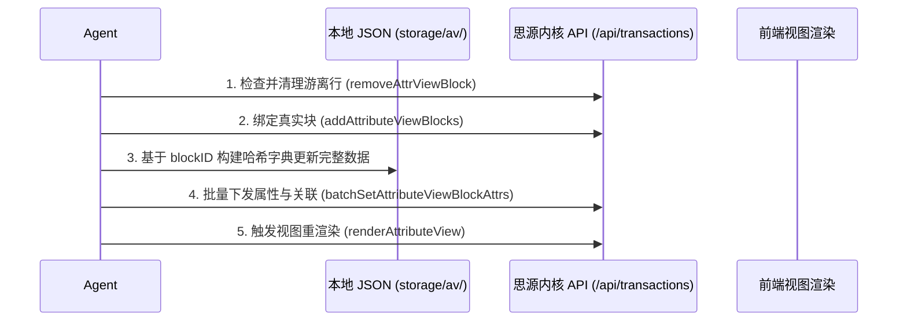

# SiYuan Database (Attribute View / 数据库) Management

This skill exists to prevent four failure modes, then apply the standard update flow and column-specific schemas that avoid them:

- **Ghost rows**: detached placeholder rows (`blockID` set, `block.id` empty, or `isDetached: true`) left when real blocks are appended, so the table doubles (e.g. 217 → 504 rows) and updates land in the placeholder half.
- **Duplicate rows**: a detached row and its real bound row both remain, so reads count one item twice.
- **Palette / order loss**: writing an unregistered option or overwriting `keyValues` on a `select` / `mSelect` cell drops the color palette and resets options in filters and kanban views.
- **Rollup / template arithmetic breaks**: comparing a rollup list instead of its number, using an integer instead of `0.0`, or dividing by zero crashes template rendering.

The schemas and transactions live in [the AV API contract](references/av-api-contract.md); template arithmetic and proven templates live in [the Go template guide](references/go-template-guide.md). Reach for either only when a column uses it.

## The Five-Step Safe Update Flow

Follow this flow for any database update. Each step ends on its own completion criterion.

1. **查与清 — inspect, then purge detached rows.** Query every existing row's `blockID` and `block.id`; collect rows where `not v.get('block', {}).get('id')` or `isDetached: true`. If any exist, remove them with the `removeAttrViewBlock` transaction (see [purging detached rows](references/av-api-contract.md#purging-detached-rows)) until none remain.
   *Completion: every remaining row has a real `block.id`, and no detached row is still addressable in kernel or memory.*
2. **建与绑 — bind real blocks.** Add real document blocks with `addAttributeViewBlocks`; record each document's `blockID`. Every row item's `blockID` now maps strictly to a real document `id`.
   *Completion: every intended row's `blockID` maps to a real document `id`.*
3. **哈希映射 — build a blockID-keyed map.** In memory, key every column value (科目, 天数, resource, single/multi select) by its `blockID`.
   *Completion: every write is addressable by `blockID`, never by array index.*
4. **批量推送 — push in slices.** Send `batchSetAttributeViewBlockAttrs` with payloads chunked to **100 rows each**; continue until no slice remains.
   *Completion: every slice is sent and acknowledged.*
5. **渲染生效 — re-render.** Call `/api/av/renderAttributeView`.
   *Completion: the UI reflects the pushed state.*

## Writing Cell Values

- **Always key writes by `blockID`** (or `itemID`); never by numeric array index as updates land in the wrong rows.
- **Protect option pools.** Before writing a `select` / `mSelect` cell, confirm the value's option is registered in `key.options`; if not, append it with its native `name` and `color` first. Writing an unregistered option or overwriting `keyValues` drops the palette and resets filters/kanban views.
- **mSelect values are object lists** `mSelect: [{"content": "...", "color": "..."}]`; assign by matching the option, not by positional index, or labels shift between rows.
- For `mAsset`, `template`, `relation`, and `rollup` columns, follow the column-specific definition and registration transaction in [special columns](references/av-api-contract.md#special-columns), and the arithmetic rules in [the Go template guide](references/go-template-guide.md).

*Completion: every modified cell carries the correct `blockID`, its select options are registered with their palette, and column-specific payloads match their schema.*

## Bidirectional Relation & Rollup Sync

When a task kanban (DB1) must show aggregated detail shared with a detail table (DB2):

1. Map each task ID (`t_bid`) to its detail row IDs (`[bid1, bid2, ...]`).
2. Write the DB1 relation cell `{"type": "relation", "relation": {"blockIDs": [bid1, bid2, ...]}}` and the DB2 back-relation cell `{"type": "relation", "relation": {"blockIDs": [t_bid]}}`.
3. Configure the rollup on DB1 over the chosen DB2 column and push it with `updateAttrViewColRollup` ([rollup schema](references/av-api-contract.md#rollup)).
4. Push batch updates in 100-row slices.

*Completion: the kanban row shows the summed detail value, both relation directions resolve to live blocks, and no row is double-counted.*

## Stop Conditions

Stop before mutating the database when any of these is true:

- the target `avID` or a column `keyID` cannot be confirmed from a live read;
- the current row set is unknown, so detached and bound rows cannot be told apart;
- the payload for a `mAsset`, `template`, `relation`, or `rollup` cell does not match its schema;
- a `template` or `rollup` write would introduce undeclared arithmetic (unregistered option, integer comparison, or unguarded division).

## Completion Gate

The update is complete only when every intended row is bound to a real document ID, every cell write used `blockID` and a registered option, the column-specific schemas held, batch slices were acknowledged, and the view re-rendered without ghost or duplicate rows.